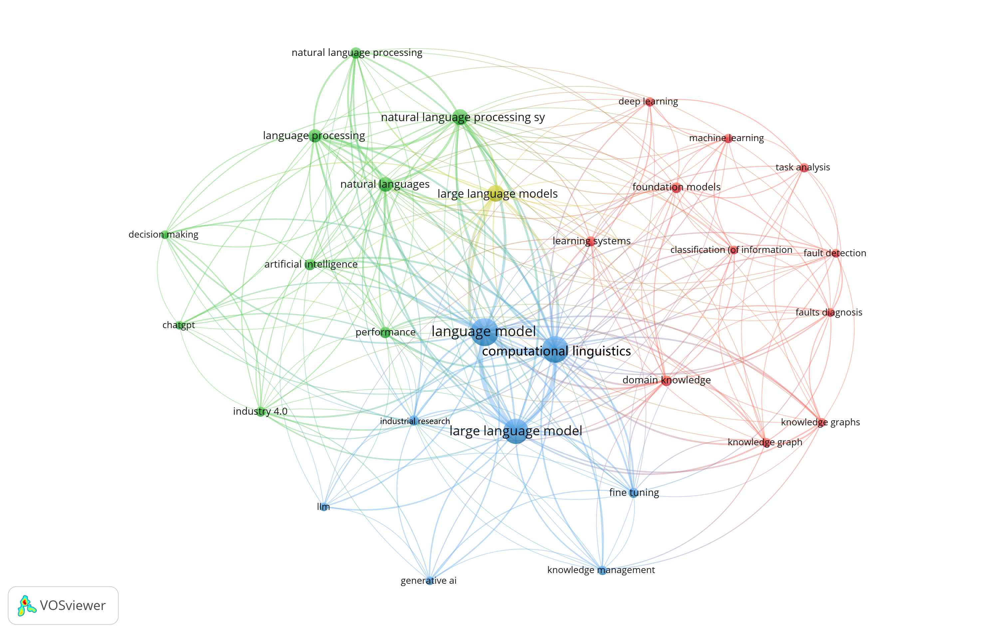

# LSFM-IM
A collection of papers and resources related to Large-Scale Foundational Models (LSFMs) in Intelligent Manufacturing Applications.

The organization of papers refers to our survey ["Large Scale Foundation Models for Intelligent Manufacturing Applications: A Survey"](https://arxiv.org/abs/2312.06718)

The emergence of LSFMs has brought new opportunities to the field of intelligent manufacturing, shifting the paradigm from single-task, single-mode, limited data models based on deep learning to encompassing multiple tasks, multiple modes, and pre-training on large-scale datasets.

## Literature Statistics

The literature collection is sourced from _Web of Science_ and [_Scopus_](scopus.csv), and the list of references is as follows:

| No. | Title | Model | Application Areas | Category | Problems solved | Methodology |
|------|------|------|------|------|------|------|
| 1 | [_LLMScenario: Large Language Model Driven Scenario Generation_](https://ieeexplore.ieee.org/abstract/document/10529537) | LLM | Autonomous driving data scenario generation | Autonomous Vehicles | Existing methods cannot handle the interpretation and reasoning of the generation process well | Proposed LLMScenario, a novel LLM-driven scenario generation framework.|
| 2 | [_Forward Learning of Large Language Models by Consumer Devices_](https://www.mdpi.com/2079-9292/13/2/402) | LLM | Edge Deployment | Edge Deployment | Backpropagation is computationally intensive | It quantitatively investigated memory usage and computational complexity improvements of PEPITA and MEMPEPITA compared to backpropagation. |
| 3 | [Harnessing Large Language Models for Cognitive Assistants in Factories](https://dl.acm.org/doi/abs/10.1145/3571884.3604313) | LLM | Staff training and work efficiency improvement | PPC | The efficient knowledge transfer among factory workers grows. | This study investigates the opportunities, risks, and user acceptance of LLM-powered Cognitive Assistants (CAs). |
| 4 | [Using Large Language Models to Enhance the Reusability of Sensor Data](https://www.mdpi.com/1424-8220/24/2/347) | LLM | IoT, sensor data processing and conversion | Sensor | Data interoperability  | Utilizing LLMs to derive structured formats from sensor data initially presented in non-interoperable formats |
| 5 | [A Voice-Controlled Motion Reproduction Using Large Language Models for Polishing Robots](https://ieeexplore.ieee.org/abstract/document/10101966) | LLM | Human-robot interaction | Human-Robot Interaction (HRI) | The transfer of skills to robots | Developed a robot system using the motion-copying system and GPT-3 |
| 6 | [Synerise Monad: A Foundation Model for Behavioral Event Data](https://dl.acm.org/doi/abs/10.1145/3539618.3591851) | Custom LLM | User behavior analysis | User behavior analysis | Event-based datalakes grows dynamically each passing hour | Generate Universal Behavior Representation (UBR) (TOKEN that encapsulates user behavior patterns) |
| 7 | [Leveraging error-assisted fine-tuning large language models for manufacturing excellence](https://www.sciencedirect.com/science/article/abs/pii/S0736584524000140) | LLM | Information retrieval | Code Generation | Domain Knowledge Complexity and Specific Software Paradigms | Error-assisted fine-tuning |
| 8 | [Empowering digital twins with large language models for global temporal feature learning](https://www.sciencedirect.com/science/article/abs/pii/S0278612524000372) | Multimodal LSFM | Digital twin | PHM | Adaptability, data utilization, and interpretability | A digital twin multi-agent architecture driven by LLM was introduced. |
| 9 | [Ontology-integrated tuning of large language model for intelligent maintenance](https://www.sciencedirect.com/science/article/pii/S000785062400026X) | LLM |  Aircraft maintenance | PHM | Lack of domain specific knowledge | Fine-tune GPT-3.5 by combining aircraft body and maintenance log data |
| 10 | [A Novel Scenarios Engineering Methodology for Foundation Models in Metaverse](https://ieeexplore.ieee.org/abstract/document/9999152) | Custom LSFM | Metaverse | Cyber-Physical Systems (CPS) | Building accessible and reliable foundation models in metaverse | The theoretical framework of scenarios engineering (SE)  named “SE-enabled foundation models in metaverse" was introduced. |
| 11 | [Large language model enhanced corpus of CO2 reduction electrocatalysts and synthesis procedures](https://www.nature.com/articles/s41597-024-03180-9) | LLM | Review | Design | Extracting crucial information related to catalysts from domain literature. | Several domain literature fine-tuned LLMs were developed |
| 12 | [Large Language Models for in Situ Knowledge Documentation and Access With Augmented Reality](https://reunir.unir.net/handle/123456789/15340) | LLM | Augmented Reality (AR) | HRI | Importing information requires a predefined structured format | Uses LLMs to help experts describe real-world elements in natural language and select corresponding AR components. |
| 13 | [A Framework and Operational Procedures for Metaverses-Based Industrial Foundation Models](https://ieeexplore.ieee.org/abstract/document/9989511) | Custom LSFM | Human-machine collaboration, efficient management and control | PPC | Optimize resource management and operational processes | This article proposes a framework and operational procedures for metaverses-based industrial foundation models in cyber–physical–social systems (CPSSs). |
| 14 | [Embodied intelligence in manufacturing: leveraging large language models for autonomous industrial robotics](https://link.springer.com/article/10.1007/s10845-023-02294-y) | LLM | Robotics | PPC | Matching tasks with process parameters, task planning, adaptability  | A control framework for industrial robots centered on LLMs was proposed. |
| 15 | [Welcome Your New AI Teammate: On Safety Analysis by Leashing Large Language Models](https://dl.acm.org/doi/abs/10.1145/3644815.3644953) | LLM | Vehicle development | Hazard Analysis & Risk Assessment (HARA) | There are iterative activities that reduce the speed of SafetyOps cycles | This research systematically assess LLMS' potential for application in the field of safety engineering |
| 16 | [ChatTwin: Toward Automated Digital Twin Generation for Data Center via Large Language Models](https://dl.acm.org/doi/abs/10.1145/3600100.3623719) | LLM | Digital twins, scene generation | CPS | Requires intensive manual processes and domain expertise | Leveraging the power of GPT-4 to automate the generation of scene description documents for digital twins |
| 17 | [Hardware Phi-1.5B: A Large Language Model Encodes Hardware Domain Specific Knowledge](https://ieeexplore.ieee.org/abstract/document/10473927) | Pre-trained LLM | Hardware design | Design | The complexity of hardware-specific issues | The first pre-trained, hardware domain-specific LLM. |
| 18 | [DeFACT in ManuVerse for Parallel Manufacturing: Foundation Models and Parallel Workers in Smart Factories](https://ieeexplore.ieee.org/abstract/document/10004441) | LLM | Task Assignment | PPC, CPS | Uncertainty, diversity, complexity in modeling, long-delayed responses to market changes, and human engineer dependency. | DeFACT: A parallel manufacturing framework where robots, digital workers, and humans interact through decentralized autonomous organizations. |
| 19 | [ChatGPT-like large-scale foundation models for prognostics and health management: A survey and roadmaps](https://www.sciencedirect.com/science/article/pii/S0951832023007640) | LLM | Review | PHM | The PHM field lacks a consensus on responding to the development of LSFMs. | Expounding of the key components and latest developments of LSFMs in PHM field. |
| 20 | [In-House Knowledge Management Using a Large Language Model: Focusing on Technical Specification Documents Review](https://www.mdpi.com/2076-3417/14/5/2096) | LLM | In-House Knowledge Management | QM, PPC | The problem of rapid review of technical specification documents. | Automated Technical Specification Review Based on Fine-tuned Language Models. |
| 21 | [Combining Ontology and Large Language Models to Identify Recurring Machine Failures in Free-Text Fields](https://ebooks.iospress.nl/doi/10.3233/ATDE240151) | LLM | Computerized Maintenance Management System (CMMS) | PHM | Data in CMMS often comprises unstructured free text, leading to high costs and resource consumption for manual analysis. | Combine NLP, domain-specific ontologies, and LLMs to extract valuable information from free-text entries. |
| 22 | [Unlocking underrepresented use-cases for large language model-driven human-robot task planning](https://www.tandfonline.com/doi/abs/10.1080/01691864.2024.2366974) | LLM | Human-robot task planning | PPC | The lacks of LLM in mission planning tasks | Experimental analysis demonstrates the shortcomings of LLMs in task planning. |
| 23 | [LLM4PLC: Harnessing Large Language Models for Verifiable Programming of PLCs in Industrial Control Systems](https://chatgpt.com/c/66fa0af2-4154-8004-8005-465300b5fa76) | LLM | Automatic PLC code generation | Code generation | The generated code lacks guaranteed execution, interpretability, and support for some niche programming languages. | Using user feedback and validation tools to guide LLM code generation, along with prompt engineering and LoRA fine-tuning. |
| 24 | [Leveraging Large Language Models for Preliminary Security Risk Analysis: A Mission-Critical Case Study](https://arxiv.org/abs/2403.15756) | LLM | Preliminary Security Risk Analysis (PSRA) | HARA | The extensive expertise and numerous text-related tasks hinder rapid evaluation in critical environments. | Fine-tuning model in PSRA。 |
| 25 | [Joint Knowledge Graph and Large Language Model for Fault Diagnosis and Its Application in Aviation Assembly](https://ieeexplore.ieee.org/abstract/document/10463190) | LLM | Aviation Assembly | PHM | Rapidly and accurately identifying the source of a fault and obtaining a troubleshooting solution based on fault symptoms. | Utilizing graph-structured Big Data within KGs to conduct prefix-tuning of the LLMs. |
| 26 | [Exploring the Potential of Large Language Models in Supply Chain Management: A Study Using Big Data](https://www.igi-global.com/article/exploring-the-potential-of-large-language-models-in-supply-chain-management/335125) | LLM | Review | SCM | Identify emerging topics, themes, and potential areas for applying LLMs in SCM. | Four core themes were derived: Supply chain optimization, supply chain risk and security management, supply chain knowledge management, and automated contract intelligence. |
| 27 | [Toward automatic generation of control structures for process flow diagrams with large language models](https://aiche.onlinelibrary.wiley.com/doi/full/10.1002/aic.18259) | Pre-trained LLM | Developing Piping and Instrumentation Diagrams (P&IDs) | PPC | Control structure prediction. | The PFD topology is represented as a string in SFILES 2.0 format for pre-training the model on grammatical structure before fine-tuning it on the real PFD. |
| 28 | [Unleashing the Potential of Large Language Models for Knowledge Augmentation: A Practical Experiment on Incremental Sheet Forming](https://www.sciencedirect.com/science/article/pii/S187705092400125X) | LLM | Incremental Sheet Forming | HRI | Common LLMs capture domain-specific knowledge with potential inaccuracies and reliance on outdated information. | Automatic and adaptive knowledge extraction, enrichment and integration into ISF specific datasets; Fine-tuning. |
| 29 | [Research on Engineering Management Question-answering System in the Communication Industry Based on Large Language Models and Knowledge Graphs](https://dl.acm.org/doi/abs/10.1145/3653946.3653961) | LLM | Engineering Management Q&A | HRI | Problems such as low efficiency in information acquisition and limited intelligence level. | A Q&A system was built by combining a large language model with a text knowledge base. |
| 30 | [Harnessing Large Language Models for Simulink Toolchain Testing and Developing Diverse Open-Source Corpora of Simulink Models for Metric and Evolution Analysis](https://dl.acm.org/doi/abs/10.1145/3597926.3605233) | LLM | Simulink  | Dataset | 1) Current testing solutions fail to detect critical toolchain bugs; 2) There's a shortage of reusable public Simulink models. | Harnessing Large Language Models for Simulink Toolchain Testing. |
| 31 | [CausalKGPT: Industrial structure causal knowledge-enhanced large language model for cause analysis of quality problems in aerospace product manufacturing](https://www.sciencedirect.com/science/article/abs/pii/S1474034623004615) | LLM | Manufacturing aerospace thin-walled shells | QM | Ambiguous causal relationships and manufacturing complexity hinder the analysis of key factors affecting quality defects. | Developed a ChatGLM-based causal knowledge graph-enhanced LLM called CausalKGPT. |
| 32 | [Generation of Asset Administration Shell With Large Language Model Agents: Toward Semantic Interoperability in Digital Twins in the Context of Industry 4.0](https://ieeexplore.ieee.org/abstract/document/10559483) | LLM | Digital twins | Interoperability | Achieving semantic interoperability in digital twins. | Created a large language model system to process "semantic nodes" and generate standardized digital twins from raw technical asset text. |
| 33 | [An LLM-based vision and language cobot navigation approach for Human-centric Smart Manufacturing](https://www.sciencedirect.com/science/article/abs/pii/S0278612524000864) | LLM | Collaborative robot navigation | Autonomous Vehicles | Collaborative robots need advanced natural interaction and enhanced perception, cognition, and action intelligence. | LLMs help AGVs interpret natural language commands and generate Python code for navigation. |
| 34 | [An LLM-based approach for enabling seamless Human-Robot collaboration in assembly](https://www.sciencedirect.com/science/article/pii/S000785062400012X) | LLM | Robotics | HRI | Intuitive interaction and fast system programming to address communication complexities in HRC. | The system uses LLMs for a natural language interface, real-time digital twin integration, and behavior-based robotic control. |
| 35 | [Edge Computing-Enabled Secure Forecasting Nationwide Industry PM2.5 with LLM in the Heterogeneous Network](https://www.mdpi.com/2079-9292/13/13/2581) | Custom LSFM | Predicting PM2.5 concentration | IS, PPC | 1) Data security 2) Current LLM cannot effectively extract spatiotemporal correlations. | A new framework named Spatio-Temporal Large Language Model combined with Edge Computing Server (STLLM-ECS) is proposed. |
| 36 | [GPT and Interpolation-Based Data Augmentation for Multiclass Intrusion Detection in IIoT](https://ieeexplore.ieee.org/abstract/document/10418592) | LLM | Industrial Internet of Things (IIoT)  | IS | IIoT network traffic datasets for common attacks are limited and often sample imbalanced. | Evaluated data augmentation techniques for training intrusion detection models on IIoT traffic data. |
| 37 | [Industrial-SAM with Interactive Adapter](https://link.springer.com/chapter/10.1007/978-981-99-8540-1_18) | LVM | Industrial vision segmentation | QM | In non-natural images, objects and backgrounds may have different characteristics and distributions. | The Interactive Adapter incorporates human feedback and generates adaptive prompts based on image content and difficulty. |
| 38 | [SAM Era: Can It Segment Any Industrial Surface Defects?](https://cdn.techscience.cn/files/cmc/2024/TSP_CMC-78-3/TSP_CMC_48451/TSP_CMC_48451.pdf) | LVM | Surface defect detection | QM | SAM has insufficient generalization ability on industrial images. | Experiments on three benchmarks compare SAM with 13 state-of-the-art defect detection models. |
| 39 | [Assessing the Impact of GPT-4 Turbo in Generating Defeaters for Assurance Cases](https://dl.acm.org/doi/abs/10.1145/3650105.3652291) | LLM | Assurance Cases (ACs) | HARA | Identifying defeaters is crucial for enhancing ACs' robustness and confidence. | Using GPT-4 Turbo to automatically identify refutations in ACs. |
| 40 | [Natural Language Navigation for Robotic Systems: Integrating GPT and Dense Captioning Models with Object Detection in Autonomous Inspections](https://ascelibrary.org/doi/abs/10.1061/9780784485262.099) | LLM | Navigation and fault detection | PHM, Autonomous Vehicles | Conventional UAV systems often require complex control schemes and lack adaptability. | Integrating LLMs with dense captioning enables drones to interpret commands and use an object dictionary from images. |
| 41 | [A novel approach to voice of customer extraction using GPT-3.5 Turbo: linking advanced NLP and Lean Six Sigma 4.0](https://link.springer.com/article/10.1007/s00170-024-13167-w) | LLM | Extraction of voice of customer | User behavior analysis | Failure to capture the richness and nuance of customer emotions. | Using GPT-3.5 Turbo for deeper understanding of dialogue context and more intuitive chat-based data processing. |
| 42 | [Using Large Language Models to Facilitate the Utilization of Specific Application Programming Interfaces in Learning Factories](https://link.springer.com/chapter/10.1007/978-3-031-65400-8_40) | LLM | Application Programming Interface (API) | HRI | Lack of proficiency in API usage. | LLMs enhance students' practical training in application implementation within manufacturing systems and learning factories. |
| 43 | [Local large language models to simplify requirement engineering documents in the automotive industry](https://www.tandfonline.com/doi/abs/10.1080/21693277.2024.2375296) | LLM | Requirements management | SCM | Simplify the requirements analysis process. | A novel and innovative Local GPT Q&A retrieval solution for requirement engineering in the automotive industry. |
| 44 | [Intelligent smelting process, management system: Efficient and intelligent management strategy by incorporating large language model](https://link.springer.com/article/10.1007/s42524-024-4013-y) | VLM | Steelmaking industry | QM, PPC | Enhancing production cost-effectiveness and operational efficiency. | The VLM module provides text descriptions for steel plate defect detection, while the LLM technology is used for production data analysis and intelligent Q&A. |
| 45 | [Performance of ChatGPT on CMRP: Potential for Assisting Maintenance and Reliability Professionals Using Large Language Models](https://ieeexplore.ieee.org/abstract/document/10311736) | LLM | AI-Assisted Maintenance | PHM | How AI can directly assist professionals in a more understandable way. | Use the Certified Maintenance & Reliability Professional (CMRP) exam to compare the M&R expertise of GPTs and human experts. |
| 46 | [HERO-GPT: Zero-Shot Conversational Assistance in Industrial Domains Exploiting Large Language Models](https://www.scitepress.org/Papers/2024/126889/126889.pdf) | VLM | Conversational coaching | HRI | Quickly adapt to various environments. | Introducing HERO-GPT, a multi-modal virtual assistant built on a multi-agent system. |
| 47 | [A Framework for Categorizing Complaint Text via Large Language Model](https://ieeexplore.ieee.org/abstract/document/10549750) | LLM | Complaint Text Classification Framework (CCF) | SCM | Businesses face a growing volume of cross-industry complaint information. | Leveraging state-of-the-art LLMs to categorize complaint information efficiently. |
| 48 | [Large Language Models Trained on Equipment Maintenance Text](https://onepetro.org/SPEADIP/proceedings-abstract/23ADIP/2-23ADIP/534517) | LLM | NLP in Equipment Maintenance | PHM | Manually extracting annotated datasets from documents is costly. | Trained a custom tokenizer to recognize domain specific terms. |
| 49 | [Large Language Model Empowered by Domain-Specific Knowledge Base for Industrial Equipment Operation and Maintenance](https://ieeexplore.ieee.org/abstract/document/10336112) | LLM | Industrial equipment operations and maintenance (IEOM) | PHM | LLMs are severely lacking in expertise in specific areas. | Exploring LLMs empowered by a domain-specific knowledge base (LLM-DSKB). |
| 50 | [Evaluation of large language models (LLMs) on the mastery of knowledge and skills in the heating, ventilation and air conditioning (HVAC) industry](https://www.sciencedirect.com/science/article/pii/S2666123324000448) | LLM | Heating, ventilation and air conditioning (HVAC) systems | HRI, PPC | It's still unknown whether state-of-the-art LLMs master sufficient knowledge related to HVAC systems. | Allowing LLMs to take the ASHRAE Certified HVAC Designer exam, an authoritative HVAC industry assessment. |
| 51 | [Enabling Foundation Models: A Distributed Collaboration Framework Based on Graph Federated Learning](https://ieeexplore.ieee.org/abstract/document/10620405) | Custom LSFM | Industrial Internet | IS | Data privacy leakage, poor scalability, and deployment difficulties. | A novel collaborative Transformer Block - wise training framework based on Federated Learning (FL). |
| 52 | [MonitorAssistant: Simplifying Cloud Service Monitoring via Large Language Models](https://dl.acm.org/doi/abs/10.1145/3663529.3663826) | LLM | Cloud Service | IS | Monitoring and anomaly detection issues in cloud service systems. | LLM automates model recommendations, enabling knowledge inheritance and simplified alarm interpretation. |
| 53 | [An Automated Evaluation Framework for Graph Database Query Generation Leveraging Large Language Models](https://ceur-ws.org/Vol-3707/D2R224_paper_6.pdf) | LLM | Query generation | SCM | Lack of a standardized framework and dataset to evaluate LLM performance. | An automated QG evaluation framework is proposed, featuring three key metrics: gold query accuracy, execution accuracy, and execution rate. |
| 54 | [Towards Industrial Foundation Models: Framework, Key Issues and Potential Applications](https://ieeexplore.ieee.org/abstract/document/10580089/) | LSFMs | Review | Industrial domain | The Industrial Foundation Model (IFM) is almost unexplored. | Introduced the concept and construction paradigm of IFM, and proposed a 5-dimensional overall framework for IFM. |
| 55 | [Automated Solution Development for Smart Grids: Tapping the Power of Large Language Models](https://ieeexplore.ieee.org/abstract/document/10171681) | LLM | Smart Grids | PPC, PHM | Fully automate the entire software development process. | Using data analysis models and self-healing technology for automated smart grid management. |
| 56 | [Empirical study on fine-tuning pre-trained large language models for fault diagnosis of complex systems](https://www.sciencedirect.com/science/article/abs/pii/S095183202400454X) | LLM | Fault diagnosis | PHM | Increasing complexity and interconnectivity of the modern industrial systems. | Studied the effectiveness of fine-tuning LLM in achieving efficient system fault diagnosis. |
| 57 | [Leveraging Large Language Models for the Automated Documentation of Hardware Designs](https://ieeexplore.ieee.org/abstract/document/10577923) | LLM | Electronic Design Automation (EDA) | Design | Reduce the document burden on engineers. | Using LLMs to create human-readable design documentation from formal hardware models. |
| 58 | [Design of Photovoltaic Cleaning Robots Assisted by Large Language Models](https://ieeexplore.ieee.org/abstract/document/10494286) | LLM | photovoltaic (PV) cleaning robot | Design | Improving robot design | Utilize LLMs for data processing and analysis to better meet requirements. |
| 59 | [The Heuristic Design Innovation Approach for Data-Integrated Large Language Model](https://link.springer.com/chapter/10.1007/978-3-031-60615-1_12) | LLM | Industrial design | Design | LLMs in specific domains falls considerably short of expectations. | DIABot offers design guidance through data retrieval integration. |
| 60 | [Advancing Human-Robot Interaction Using AI – A Large Language Model (LLM) Approach](https://link.springer.com/chapter/10.1007/978-3-031-57496-2_12) | LLM | Robots work alongside humans | HRI | Improve productivity, efficiency, and safety in the production process. | Enabling humans to communicate in natural language, thereby advancing HRI during the execution and programming phases. |
| 61 | [Towards autonomous system: Flexible modular production system enhanced with large language model agents](https://ieeexplore.ieee.org/abstract/document/10275362/) | LLM | Digital twins and industrial automation system | PPC | Task execution complexity, poor information interpretation, and lack of multi-level functional integration. | A novel framework has been proposed that combines LLMs, digital twins, and industrial automation systems. |
| 62 | [Assessment of a large language model based digital intelligent assistant in assembly manufacturing](https://www.sciencedirect.com/science/article/pii/S0166361524000575) | LLM | Assembly manufacturing | HRI | Improve performance and reduce cognitive workload. | Evaluate the LLM assistant's robustness, its impact on operator workload and user experience, and assembly performance improvement. |
| 63 | [Advancing multimodal diagnostics: Integrating industrial textual data and domain knowledge with large language models](https://www.sciencedirect.com/science/article/abs/pii/S0957417424014702) | LLM | Technical documents and maintenance logs | PHM | Utilize complex data often underused due to domain-specific terminology. | Integrating domain knowledge from unstructured text into diagnostic models with LLMs. |
| 64 | [Empower Large Language Model to Perform Better on Industrial Domain-Specific Question Answering](https://arxiv.org/abs/2305.11541) | LLM | Question Answering | HRI | Due to insufficient domain knowledge, LLMs perform average in specific industrial scenarios. | 1) Microsoft product technical Q&A dataset MSQA 2) A new LLM interaction paradigm. |
| 65 | [Digital Twin and Foundation Models: A New Frontier](https://pdfs.semanticscholar.org/6110/8c51cfbaf9e05c164875349d90ff335a6b2f.pdf) | LLM | Review | PPC, CPS | Enhancing the functionality of digital twin solutions in various sectors. | Explored the integration of LSFMs with digital twins, analyzing applications, challenges, and prospects. |
| 66 | [Fault Diagnosis and System Maintenance Based on Large Language Models and Knowledge Graphs](https://ieeexplore.ieee.org/abstract/document/10489566) | LLM | Computer Numerical Control (CNC) machine tools | PHM | LLMs have been criticized by their "hallucination" for the specialized fields. | Build a knowledge graph and fine-tuning dataset for fine-tuning and deploying LLM in the industrial field. |
| 67 | [Enhancing IoT and cyber-physical systems in industry 4.0 through on-premise large language models: real-time data processing, predictive maintenance, and autonomous decision-making](https://ceur-ws.org/Vol-3723/paper10.pdf) | LLM | Review | PHM, PPC, CPS | Utilization of LLMs for improved data analysis, decision-making processes, and operational efficiency in industrial settings. | Explore the integration of on-premise LLMs with IoT and CPS within the framework of Industry 4.0. |
| 68 | [On the Accuracy and Robustness of Large Language Models in Chinese Industrial Scenarios](https://ieeexplore.ieee.org/abstract/document/10577317) | LLM | Review | Manufacturing | The potential and specific challenges of LLMs in manufacturing applications. | A comprehensive empirical study that assesses the accuracy and robustness of local LLMs in industrial scenarios. |
| 69 | [BearingFM: Towards a foundation model for bearing fault diagnosis by domain knowledge and contrastive learning](https://ceur-ws.org/Vol-3723/paper10.pdf) | Custom LSFM | Bearing fault diagnosis | PHM | A severe lack of labeled samples hinders the deployment of fault diagnosis models across extensive workshop equipment. | 1) Cloud-edge collaborative semi-supervised learning framework 2) Data enhancement method based on bearing failure mechanism. 3) Novel contrastive learning model. |
| 70 | [Knowledge sharing in manufacturing using LLM-powered tools: user study and model benchmarking](https://www.frontiersin.org/journals/artificial-intelligence/articles/10.3389/frai.2024.1293084/full) | LLM | Knowledge sharing and problem solving | PPC | Production line operations are becoming more knowledge-intensive, straining factories' capacity to train and support new operators. | LLM system for retrieving information from plant documentation and knowledge shared by expert operators. |
| 71 | [Navigating SoC Security Landscape on LLM-Guided Paths](https://dl.acm.org/doi/abs/10.1145/3649476.3660393) | LLM | Review | Design, hardware | System-on-Chip (SoC) design security requires innovative solutions due to its complexity and asset distribution across Intellectual Property (IP) blocks. | This paper reviews LLMs in HDL generation, verification, and bug fixing, noting challenges and opportunities. |
| 72 | [Towards an LLM-based Intelligent Assistant for Industry 5.0](https://ceur-ws.org/Vol-3701/paper7.pdf) | LLM |  Intelligent Cognitive Assistants (ICAs) | HRI | Lack adaptability, information overload. | System integrates industrial data from IoT-connected machines into a chatbot interface. |
| 73 | [Resiliency Analysis of LLM generated models for Industrial Automation](https://ieeexplore.ieee.org/abstract/document/10458189) | LLM | Automatically generated systems | PPC | Understand the effectiveness, reliability, and improvements of automated systems in industrial automation. | A study of the resilience and efficiency of automatically generated industrial automation and control systems using LLM. |
| 74 | [Segment Anything Is Not Always Perfect: An Investigation of SAM on Different Real-world Applications](https://link.springer.com/article/10.1007/s11633-023-1385-0) | LVM | Practical application investigations | QM | Get a comprehensive look at SAM in action. | A series of interesting investigations into the performance of SAM in various applications. |
| 75 | [Optimizing Scanning Acoustic Tomography Image Segmentation With Segment Anything Model for Semiconductor Devices](https://ieeexplore.ieee.org/abstract/document/10645767) | LVM | Scanning Acoustic Tomography (SAT) | QM | Manual methods are often costly and prone to human error. | Fine-tuning of SAM. |
| 76 | [Industrial Semiconductor GPT: A Question-and-Answer System that Provides Professional Advice and Problem-Solving Methods for Semiconductor and Factory Equipment and Process](https://ieeexplore.ieee.org/abstract/document/10595824) | LLM | Q&A System | PHM, HRI | On-site personnel must detect, predict, and address abnormal conditions in processes and equipment. | Embed technical documents of process equipment into a vector database and generate potential professional Q&A. |
| 77 | [Agentic Relationship Dynamics in Human-AI Collaboration: A Study of Interactions with GPT-based agentic Information Systems Artifacts](https://scholarspace.manoa.hawaii.edu/items/029387d5-112d-44a4-b555-156b18f8b77b) | LLM | Review | PPC, HRI | Study the interactions between humans and artificial intelligence agents and their outcomes. | This paper reviews literature on human-machine collaboration, focusing on task delegation mechanisms in AI agents like GPT. |
| 78 | [Multi-attribute Auction-Based Resource Allocation for Twins Migration in Vehicular Metaverses: A GPT-Based DRL Approach](https://arxiv.org/abs/2406.05418) | LLM | Vehicular Metaverses  | Edge Deployment | Vehicle twins updates and vehicle mobility demand significant computing, communication, and storage resources. | Using LLM-based deep reinforcement learning algorithms to train DDA auctioneers to optimize resource allocation. |
| 79 | [Natural Language Processing for Supply Chain with Chat GPT](https://ieeexplore.ieee.org/abstract/document/10452639) | LLM | Order document enquiry | SCM | The component specifications in the document were unstructured and manually reviewed by employees. | Built a fine-tuned GPT-3 model for keyword extraction. |
| 80 | [Workpiece Segmentation Based on Improved YOLOv5 and SAM](https://ieeexplore.ieee.org/abstract/document/10505346) | LVM | Workpiece Segmentation | QM | Traditional image segmentation algorithms, based on manually designed features, yield poor performance. | YOLOv5 enhances feature extraction and works with the SAM model, using binocular vision to segment the topmost workpiece. |
| 81 | [Digitization of the enterprise - prospects for process automation with using RPA and GPT integration](https://www.sciencedirect.com/science/article/pii/S187705092301476X) | LLM | Review | PPC | identify potential digitization directions for process automation using the integration of RPA and GPT technologies. | Digitalization and process automation concepts are reviewed, terminology clarified, and ChatGPT-RPA integration explored via a green energy case study. |
| 82 | [Generative artificial intelligence and data augmentation for prognostic and health management: Taxonomy, progress, and prospects](https://www.sciencedirect.com/science/article/abs/pii/S0957417424013782?via%3Dihub) | AIGC | Diagnosis, detection, and prognostics | PHM | The information collected from sensor readings regarding device status is limited. | Provides a comprehensive review of data augmentation and generation (DA&G) techniques aimed at solving the DDP problems. |
| 83 | [Integration of Foundation Models and Federated Learning in AIoT-Based Aircraft Health Monitoring Systems](https://www.mdpi.com/2227-7390/12/21/3428) | Custom LSFM | Aircraft health monitoring systems (AHMSs) | PHM | The robustness, scalability, and security of the system. | A comprehensive framework has been proposed for integrating fundamental models , federated learning , and IoT technologies. |
| 84 | [Generating the assembly instructions of helicopter subassemblies using the hierarchical pruning strategy and large language model](https://www.sciencedirect.com/science/article/abs/pii/S2452414X24001663?via%3Dihub) | LLM | Assembly instruction generation | | Process designers need to spend lots of time thinking and authoring assembly instructions. | |
| 85 |  | | | | | |
| 86 |  | | | | | |
| 87 |  | | | | | |
| 88 |  | | | | | |
| 89 |  | | | | | |
| 90 |  | | | | | |
| 91 |  | | | | | |
| 92 |  | | | | | |
| 93 |  | | | | | |
| 94 |  | | | | | |
| 95 |  | | | | | |
| 96 |  | | | | | |
| 97 |  | | | | | |
| 98 |  | | | | | |
| 99 |  | | | | | |
| 100 |  | | | | | |
| 101 |  | | | | | |
| 102 |  | | | | | |
| 103 |  | | | | | |
| 104 |  | | | | | |
| 105 |  | | | | | |
| 106 |  | | | | | |
| 107 |  | | | | | |
| 108 |  | | | | | |
| 109 |  | | | | | |
